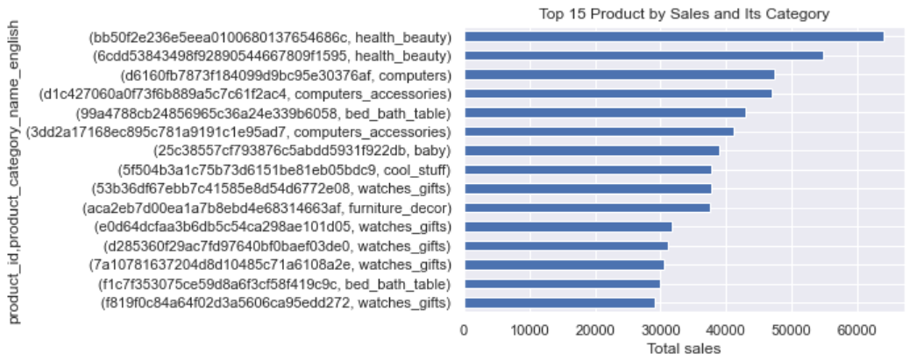

# Analisis Data Brazilian E-Commerce
# Pendahuluan
[Olist merupakan salah satu department store terbesar di Brazil](https://www.kaggle.com/datasets/olistbr/brazilian-ecommerce). Data yang digunakan dalam analisis ini adalah data dari layanan ecommerce-nya yang menghubungkan seller dengan customer melalui web `olist.com` dan mengirimkan pesanan melalui partner logistik. Dataset yang disediakan adalah dataset transaksi asli tahun 2016-2018, dengan berbagai perubahan untuk menjaga kerahasiaan seller dan customer.

# Objektif Analisis
1. Mengetahui produk yang menyumbang total volume dan total penjualan tertinggi
2. Mengetahui frekuensi jumlah order per customer
3. Mengetahui jalur pengiriman paling banyak dilalui
4. Mengetahui persentase SLA pengiriman

# Data Overview
Terdapat beberapa tabel dalam database `olist`. Untuk menjawab objektif dari analisis ini kita membutuhkan data dari tabel berikut.
1. olist_order_dataset
2. olist_order_items_dataset
3. olist_products_dataset 
4. product_category_name_translation
5. olist_order_customer_dataset -> mengetahui lokasi destinasi pengiriman
6. olist_sellers_dataset -> mengetahui lokasi asal pengiriman

Data yang dipakai dalam analisis sesuai dengan query di bawah ini.
```sql
SELECT
	o.*,
	cat.product_category_name_english,
	p.product_category_name,
	oi.product_id,
	oi.price,
	cus.customer_zip_code_prefix AS destination_zip_code,
	cus.customer_city AS destination_city,
	cus.customer_state AS destination_state,
	sel.seller_zip_code_prefix AS source_zip_code,
	sel.seller_city AS source_city,
	sel.seller_state AS source_state
FROM
	olist_order_dataset o
LEFT JOIN olist_order_items_dataset oi
    ON o.order_id = oi.order_id
LEFT JOIN olist_products_dataset p 
    ON oi.product_id = p.product_id
LEFT JOIN product_category_name_translation cat
    ON p.product_category_name = cat.product_category_name
LEFT JOIN olist_order_customer_dataset cus
    ON o.customer_id = cus.customer_id
LEFT JOIN olist_sellers_dataset sel
    ON oi.seller_id = sel.seller_id
WHERE
	o.order_status IN ('shipped', 'delivered')
```

# Data Cleaning

## Missing data

Secara keseluruhan, terdapat 1.89% produk yang dipesan yang tidak memiliki informasi kategori dalam Bahasa Inggris (`product_category_name_english`). Jika kita hanya mengambil data order dengan status `shipped` atau `delivered` maka terdapat 1.42% data produk yang tidak memiliki informasi kategori dalam Bahasa Inggris. Dari 111 ribu baris data terdapat 1 baris yang detail produknya tidak ditemukan karena `order_id` nya tidak ditemukan di tabel order item dan hal ini bisa diabaikan.

## Outlier

Kita akan mengecek outlier dari sebaran data harga (`price`). Harga produk kita ambil bukan dari data produk melainkan dari data transaksi karena untuk tiap `product_id`, harganya bisa berbeda-beda untuk order yang berbeda. Kita bisa ambil nilai unik dari harga dengan mengkombinasikan harga dengan `product_id`, sehingga 1 nilai unik dari harga adalah 1 kombinasi `product_id` dan `price`. Didapatkan bahwa nilai persentil ke-99 nya adalah 1150.


Jika kita melihat Top 15 kategori produk mahal yaitu produk dengan harga di atas persentil ke-99, maka kategori produk yang termasuk produk mahal masih terlihat reasonable. Kategori `watches_gifts` termasuk yang memiliki paling banyak produk yang tergolong mahal, mencapai 70 produk jauh di atas yang lain. 


# Analisis

## Produk yang menyumbang total volume dan total penjualan tertinggi

Produk yang paling banyak dibeli adalah produk dengan `product_id = 'bb50f2e236e5eea0100680137654686c'`. Karena tidak ada info nama produk yang menggambarkan jenis produk, maka diambil keterangan kategori produk (`product_category_name_english`) untuk mendapatkan info jenis produk.


Produk dengan penjualan terbesar berasal dari kategori `bed_bath_table`. Produk top 15 lainnya banyak berasal dari kategori `garden_tools` dan `health_beauty`.


Walaupun demikian, dari top 15 produk berdasarkan volume penjualan hanya terdapat 7 produk yang ikut menyumbang top 15 sales. Produk dari kategori `health_beauty` menempati urutan pertama sebagai produk dengan penjualan tertinggi, namun produk dari kategori `watches_gifts` lebih banyak menjadi produk penyumbang top 15 penjualan.




## Frekuensi order per customer

Dari dataset ini tampak bahwa tidak ada customer yang melakukan repeat order sama sekali (total order per customer > 1). Hal ini mungkin menunjukkan bahwa dataset yang diberikan bukanlah dataset keseluruhan, namun sampling dari dataset yang lebih besar. Kemungkinan lainnya, skema pembelian produk tidak mengharuskan customer untuk registrasi, sehingga setiap kali seorang customer melakukan pembelian akan tergenerate customer ID baru.


## Jalur pengiriman paling banyak dilalui

Jalur pengiriman dapat dilihat dari nama kota asal paket dan nama kota tujuan. Walaupun demikian, sangat mungkin terdapat salah ketik atau perbedaan lainnya yang menyebabkan suatu kota tidak digolongkan sebagai satu kota yang sama. Contohnya data paket dengan zip code `13456` seakan memiliki 2 kota asal, `santa barbara d'oeste` dan `santa barbara d oeste`.


Selain itu, zip code yang ada di dataset ini hanya menampilkan bagian prefix-nya saja. [Brazil memiliki sistem zip code berupa prefix diikuti 3 angka](https://www.angloinfo.com/how-to/brazil/housing/postal-system), sehingga zip code yang ada di dataset ini bisa menuju dua kota yang berbeda karena kode akhiran 3 angkanya bisa berbeda.

Pengiriman paling banyak dilakukan dari dan ke dalam kota Sao Paulo.


Pengiriman paling banyak dilakukan antar daerah di negara bagian Sao Paulo, diikuti Sao Paulo ke Rio de Janeiro.


Untuk mengetahui nama tiap-tiap negara bagian, gunakan [dataset tambahan berisi info nama negara bagian berdasarkan kodenya](https://raw.githubusercontent.com/datasets-br/state-codes/master/data/br-state-codes.csv). Dengan data ini, kita bisa melihat bahwa terdapat 3 jalur pengiriman utama dimana tiga rute ini menyumbang sebanyak 48.16% total order.
1. Sao Paulo -> Sao Paulo
2. Sao Paulo -> Rio de Janeiro
3. Sao Paulo -> Minas Gerais


Berdasarkan total penjualan, tiga rute utama ini juga menjadi tiga rute teratas penyumbang total penjualan. Sebanyak 41.7% penjualan datang dari tiga rute ini.


## Persentase SLA pengiriman

Umumnya order di E-commerce memiliki estimasi waktu pengiriman berupa rentang tanggal. Rentang tanggal ini akan bergantung pada jenis 3PL dan rate pengiriman (instan, reguler, dll). Dengan mengasumsikan bahwa tanggal pengiriman pada `order_estimated_delivery_date` adalah waktu pengiriman maksimum (paling lama), maka jika suatu order memiliki waktu `order_delivered_customer_date` lebih lama dari `order_estimated_delivery_date`, bisa disimpulkan bahwa pengiriman order tersebut tidak memenuhi SLA pengiriman.

```python
df_sales['delivery_days_diff'] = (df_sales.order_delivered_customer_date.dt.date - df_sales.order_estimated_delivery_date.dt.date) / np.timedelta64(1, 'D')
```
Dapat dilihat bahwa lebih banyak order yang terkirim sebelum mencapai tanggal estimasi pengiriman. 


```python
df_sales['sla'] = np.where(df_sales.delivery_days_diff>0,'late','on-time')
```


Secara keseluruhan, lebih dari 90% pengiriman mencapai SLA. Namun kita akan melihat SLA pengiriman tiap bulannya untuk menangkap tren pengiriman sepanjang Sep 2016 - Sep 2018.

```python
df_late_order = pd.merge(df_sales.resample('MS', on='order_purchase_timestamp')['order_id'].nunique().to_frame().reset_index().rename(columns={'order_id':'total_order'}),
         df_sales[df_sales.sla=='late'].resample('MS', on='order_purchase_timestamp')['order_id'].nunique().to_frame().reset_index().rename(columns={'order_id':'late_order'}),
         on='order_purchase_timestamp')
df_late_order['late_pct'] = round(df_late_order.late_order / df_late_order.total_order * 100, 2)
```

Pengiriman mengalami puncak keterlambatan paling tinggi untuk order di bulan Maret 2018 yaitu sebanyak 18.61% total order. 


Mari kita lihat lebih detail persentase SLA berdasarkan rute untuk bulan Maret 2018.

```python
df_late_order_route = pd.merge(df_sales[df_sales.order_purchase_timestamp.dt.to_period('M').dt.to_timestamp()=='2018-03-01'].reset_index(drop=True).groupby('shipping_route_state_name').resample('MS', on='order_purchase_timestamp')['order_id'].nunique().to_frame().reset_index().rename(columns={'order_id':'total_order'}),
         df_sales[(df_sales.sla=='late') & (df_sales.order_purchase_timestamp.dt.to_period('M').dt.to_timestamp()=='2018-03-01')].reset_index(drop=True).groupby('shipping_route_state_name').resample('MS', on='order_purchase_timestamp')['order_id'].nunique().to_frame().reset_index().rename(columns={'order_id':'late_order'}),
         on=['order_purchase_timestamp','shipping_route_state_name'],
         how='left')
df_late_order_route['late_pct'] = round(df_late_order_route.late_order / df_late_order_route.total_order * 100, 2)
df_late_order_route
```

Pengiriman order melebihi SLA terbanyak di bulan Maret 2018 terdapat di rute `São Paulo-Rio de Janeiro`, yaitu 248 pengiriman telat atau 39.81% dari total pengiriman bulan tersebut. Rute ini adalah salah satu dari 3 rute yang paling banyak dilalui. 

